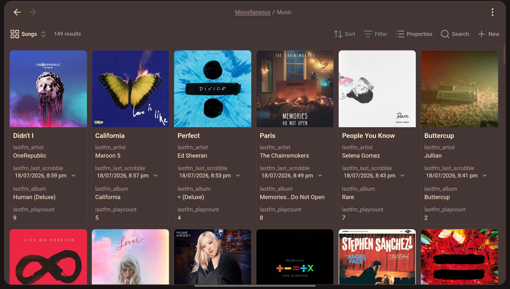
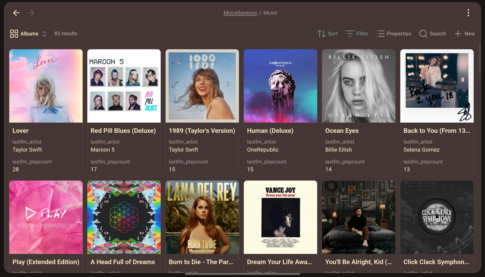
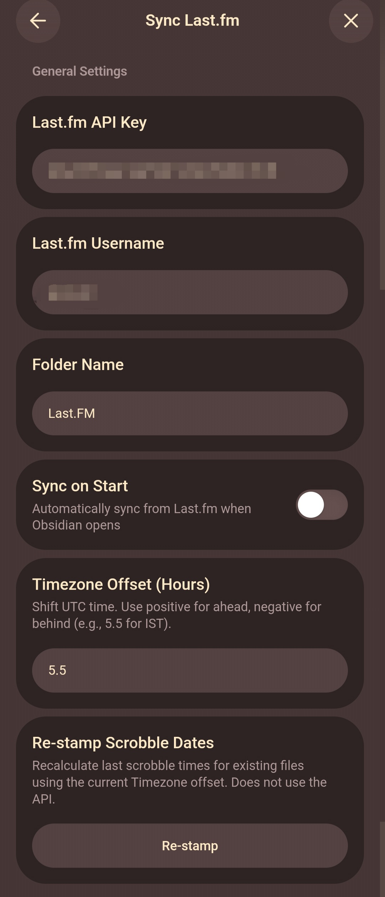
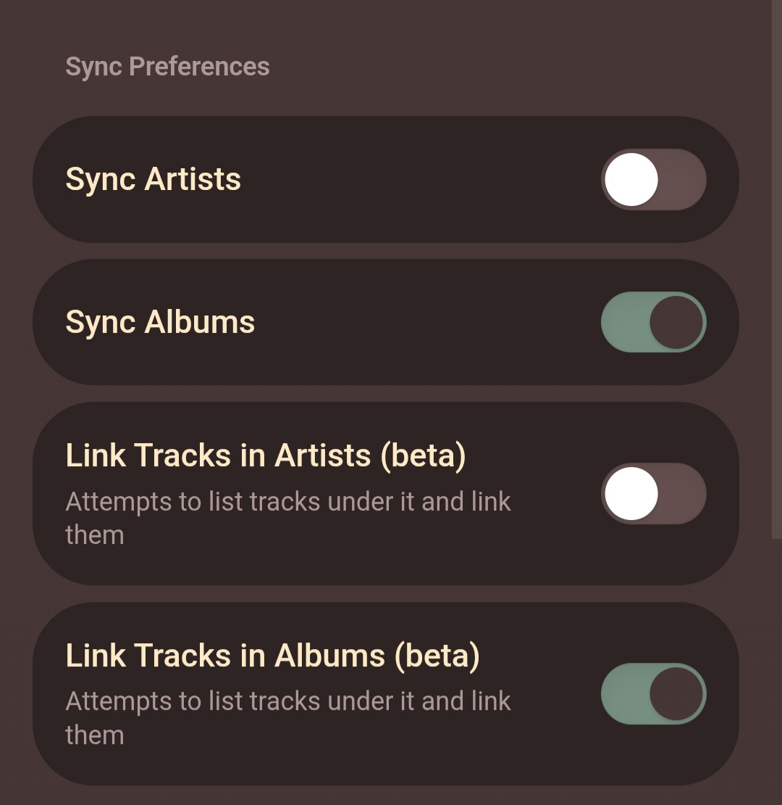
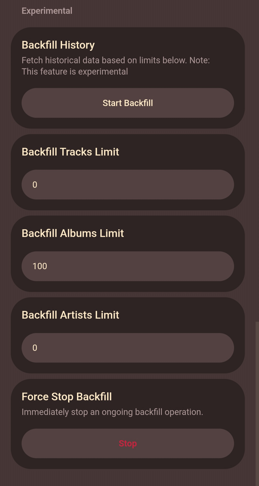

# Sync Last.fm for Obsidian

Seamlessly fetch scrobbles, artists, albums and cover art from Last.fm and auto creates notes with properties which can be directly used in Base.

---

## Table of Contents
| Section | Description |
| :--- | :--- |
| [Screenshots](#screenshots) | Visual previews from tablet and mobile interfaces. |
| [Features](#features) | A comprehensive list of what this plugin can do. |
| [Installation](#installation) | Step-by-step guide to installing the plugin manually. |
| [API Key Guide](#api-key-guide) | Steps to obtain your free Last.fm API key. |
| [Feedback & Issues](#feedback--issues) | How to report bugs or request features. |
| [License & Legal](#license--legal) | Copyright, AI, and licensing information. |

---

## Screenshots

  
    
  
  <!-- Mobile Screenshots Row -->
  
  &nbsp;
  
  &nbsp;
  

---

## Features

* **Incremental Syncing**: Only pulls new tracks since your last sync, keeping API requests lightning fast.
* **Artists & Albums Extraction**: Dedicated folders for your top Artists and Albums, complete with playcounts and cover images.
* **Smart Backlinking**: Automatically links your scrobbled tracks directly into their respective Artist and Album notes.
* **Custom Timezone Adjustments**: Bypass your system clock and manually offset UTC time (e.g., `5.5` for IST) to ensure your scrobble dates are always perfectly accurate.
* **Re-stamp Existing Data**: Change timezones? Re-calculate the local timestamps for all your existing track files instantly without needing to hit the Last.fm API.
* **Historical Backfill**: A dedicated option to pull historical tracks, artists, and albums up to custom limits.

---

## Network Usage

Per Obsidian's community plugin policies, plugins must disclose their network activity. 

This plugin requires an active internet connection to function. It makes outbound requests **exclusively** to the official Last.fm API (`https://ws.audioscrobbler.com`) to fetch your scrobble history, top artists, top albums, and track metadata based on the username and API key you provide. 

---

## Installation

  
<strong>From Obsidian Community (Recommended)</strong>

 
  The easiest way to install and keep the plugin updated:
 
  1. Open Obsidian and go to **Settings** > **Community Plugins**.
  2. Turn off "Safe Mode" if you haven't already.
  3. Click **Browse** and search for **Last.fm Sync**.
  4. Click **Install**, then click **Enable**.
 
  Alternatively, click here to open it directly in Obsidian: 
  [Install Last.fm Sync](https://community.obsidian.md/plugins/sync-lastfm)

  
<strong>Install Manually</strong>

  If you prefer to install manually via GitHub Releases:

1. Go to the [Releases page](https://github.com/jaival-11/lastfm-obsidian-plugin/releases) of this repository.
2. Download the latest `main.js`, `styles.css` and `manifest.json` files.
3. Open your file manager and navigate to your Obsidian Vault. 
4. Make sure you can see hidden files (enable "Show hidden files" in your file manager settings).
5. Navigate to `.obsidian` > `plugins`.
6. Create a new folder inside `plugins` named `sync-last.fm`.
7. Move the downloaded `main.js`, `styles.css` and `manifest.json` files into this new `sync-last.fm` folder.
8. Restart Obsidian, go to **Settings** > **Community Plugins**, and turn off "Safe Mode".
9. Toggle on **Last.fm Sync** in the plugin list.

  
<strong>Manually Build Yourself</strong>

  If you want to compile the plugin from the source code:

  1. Clone this repository: `git clone https://github.com/jaival-11/lastfm-obsidian-plugin.git`
  2. Navigate to the directory: `cd lastfm-obsidian-plugin`
  3. Install the dependencies: `npm install`
  4. Build the plugin: `npm run build`
  5. Create a folder named `sync-last.fm` in your vault's `.obsidian/plugins/` directory.
  6. Copy the newly generated `main.js`, `styles.css` and `manifest.json` into that folder.
  7. Restart Obsidian and enable the plugin.

---

## API Key Guide

To sync your data, you will need a free API key from Last.fm:

1. Go to the [Last.fm API Account Creation page](https://www.last.fm/api/account/create).
2. Log in with your Last.fm account if you aren't already logged in.
3. Fill out the application form (you only need to provide an **Application name**, e.g., "Last.fm for Obsidian").
4. Submit the form to generate your credentials.
5. Copy the **API Key** (you do not need the shared secret) and paste it into the plugin's settings in Obsidian.

---

## Feedback & Issues

If you run into any bugs, have a feature suggestion, or just want to help improve the plugin, feel free to open an issue! 

[Open an Issue](https://github.com/jaival-11/lastfm-obsidian-plugin/issues)

---

## License & Legal

**Disclaimer**: This plugin is an unofficial tool and is not affiliated with, endorsed, or sponsored by Last.fm.

**AI Disclaimer**: Documentation and code for this project were created with the assistance of Artificial Intelligence.

**No Warranty**: This software is provided "as is", without warranty of any kind, express or implied. The author shall not be liable for any claims, damages, data loss, or other liability arising from, out of, or in connection with the software or the use thereof. Use at your own risk.

This project is licensed under the MIT License - see the [LICENSE](LICENSE) file for details.

---

**Made with ❤️ by Jaival**

